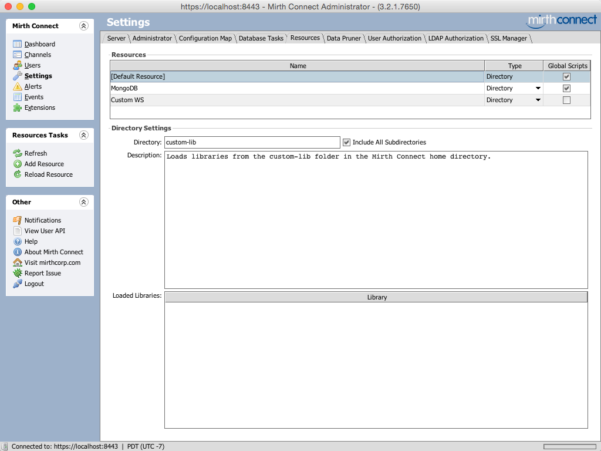
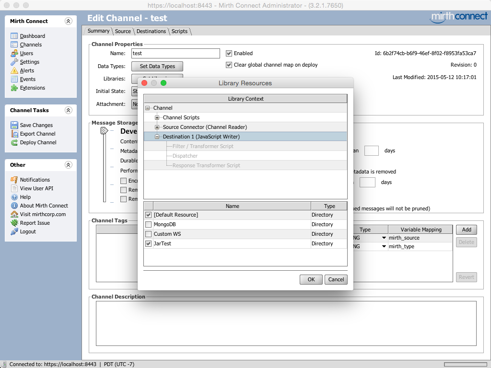
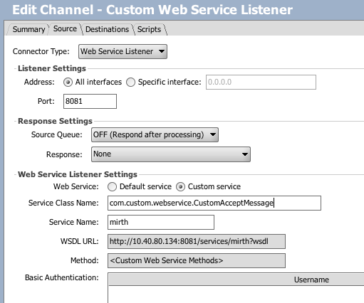

# Create a web service in Mirth
This tutorial describes an example of creating a web service from a java project that has a class that extends com.mirth.connect.connectors.ws.AcceptMessage

1.	Create a new Java project and create a class that extends com.mirth.connect.connectors.ws.AcceptMessage (i.e. the class(es) which will be invoked from Mirth Connect) You may import internal Mirth Connect packages if you need to extend some class or implement some interface (see [here](http://www.mirthcorp.com/community/wiki/display/mirth/Developing+Mirth+Connect+in+Eclipse) for an example of extending AcceptMessage for a custom Web Service Listener), but you certainly don't need to. 
This example will extemd the class com.mirth.connect.connectors.ws.AcceptMessage:

		package com.custom.webservice;
		import javax.jws.WebMethod;
		import javax.jws.WebParam;
		import javax.jws.WebService;
		 
		import com.mirth.connect.connectors.ws.AcceptMessage;
		import com.mirth.connect.connectors.ws.WebServiceReceiver;
		 
		@WebService
		public class CustomAcceptMessage extends AcceptMessage {
		  
		    public CustomAcceptMessage(WebServiceReceiver webServiceReceiver) {
		        super(webServiceReceiver);
		    }
		  
		    @WebMethod(action = "sample_operation")
		    public String operation(@WebParam(name = "param_name") String param) {
		        // implement the web service operation here
		        return param;
		    }
		  
		    @WebMethod(action = "add")
		    public int add(@WebParam(name = "i") int i, @WebParam(name = "j") int j) {
		        int k = i + j;
		        return k;
		    }
		 
		    // multiple response example
		    @WebMethod(action = "calculate")
		    public void calculate(@WebParam(name = "sum", mode = WebParam.Mode.OUT) Holder<Integer> sum, @WebParam(name = "multiply", mode = WebParam.Mode.OUT) Holder<Integer> multiply) {
		        sum.value = 4+5;
		        multiply.value = 4*5;
		    }
		 
		    @WebMethod(action="swap")
		    public Values swap(@XmlElement(required=true)
		                       @WebParam(name=valus) Values values)
		    {
		        values = new Values(values.getLeft(), values.getRight());
		 
		        // Tell the channel that we actually did something
		        super.webServiceReceiver.processData(String.valueOf(values));
		 
		        return values;
		    }
		 
		    // This class may have to be in a separate file to work properly
		    // (i.e. not an inner class). It's only here to make the example
		    // simpler.
		    public static class Values {
		        private int left;
		        private int right;
		        public Values(int left, int right) {
		            this.left = left;
		            this.right = right;
		        }
		        // The @XmlElement annotation lets the WS-generator know that
		        // these represent properties that should be serialized to XML
		        @XmlElement
		        public int getLeft() { return left; }
		        @XmlElement
		        public int getRight() { return right; }
		    }
		 }

	Note that it must have the package name declared. You can implement your code in a single class or using many classes.

2. In the rest of your projects, you can include classes such as:

    com.mirth.connect.connectors.ws.AcceptMessage.class
    com.mirth.connect.connectors.ws.DefaultAcceptMessage.class
    com.mirth.connect.connectors.ws.LoggingSOAPHandler.class
    com.mirth.connect.connectors.ws.WebServiceConnectorService.class
    com.mirth.connect.connectors.ws.WebServiceDispatcher.class
    com.mirth.connect.connectors.ws.WebServiceReceiver.class 

3.	Export this project as a jar file 
	
	**Compiling your code**
	Now you need to convert your source code into compiled class files, which will be included in the JAR. In a command-line terminal, navigate to the top-level folder that contains your src and classes folders. Then do this:

		javac -d classes src/com/example/*

	If you need to include other libraries in the classpath, use the -cp option. Type "javac -help" for the full set of options.
	
	**Creating the JAR file**
	Now you should have JarTest.class in the classes/com/example folder, so the next step is to archive it into a JAR file. In the same top-level directory as before, do this:

		jar -cf JarTest.jar -C classes com

	The -c option means you're creating a new archive, and -f specifies the filename to output with. The -C option changes the working directory before adding files. Finally, the "com" at the end indicates what files/folders to include in the archive.

	You can also compile source files and create a JAR in one step in Eclipse, with the export feature.

	Note that your newly created CustomAcceptMessage.java file will be in the following structure:

    src
        com
            example
                CustomAcceptMessage.java
    classes

	Note how there are two top-level folders, src and classes. The src folder will contain your source files (.java), and the classes folder will contain your compiled class files (.class).

4. Add your project to mirth libs

	You will be able to use the custom class anywhere JavaScript is used. For example, you can create a new channel that uses a JavaScript Writer destination, and use the following code:
	
		var obj = new Packages.com.example.JarTest();
		logger.info(obj.returnSomething());

	At first this channel won't yet work; we need to include the JAR that we just created.

	* Mirth Connect 3.1.1 or earlier
		* Drop the JAR file into the lib/custom folder (for version 1.8.2 or earlier) or custom-lib (for versions 2.0.0 through 3.1.1) under your Mirth Connect home directory. This way, the classloader should be able to locate it.
		* Restart the Mirth Connect service, and login to the Administrator.

    *  Mirth Connect 3.2.0 or later
    	*	In 3.2 or later you can define custom resources to point to any directory you want. So you can drop the JAR file into the custom-lib folder, or create a new folder anywhere on the server filesystem.
    	*	Restarting Mirth Connect is not required. Instead, in the Administrator navigate to the Settings -> Resources tab. 
    			
    	*	Create a new Directory resource if needed. If you're just using the custom-lib folder, and the default resource is pointing to custom-lib (it will by default), then you only need to hit Reload Resource and the JAR will automatically be picked up. Hit the refresh button if the JAR doesn't show up initially. You should now see it in the Loaded Libraries table at the bottom.
    			
    	*	Edit the channel you want to use the resource with, go to the Summary tab, and click the Set Libraries button. Make sure the resource is checked for the context you want to use it in. If you're using the default resource, it should already be checked by default.
    			
    	*	Redeploy the channel if you made any changes to it.

 5.	You can now create your own custom web service listener

